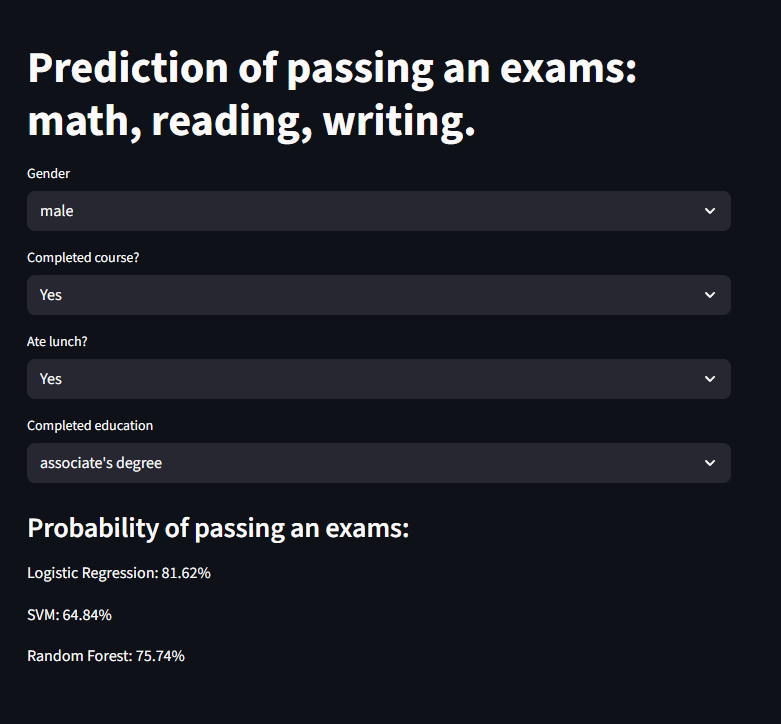

# Exam pass prediction app
> [!NOTE]
> Python ver: 3.13.12

> [!IMPORTANT]
> ### Needed libraries installed through pip:
> - matplotlib
> - numpy
> - pandas
> - scikit_learn
> - seaborn
> - streamlit

> [!TIP]
> ### How to run a local hosted app:
> - Download this project
> - Go into folder with this project
> - Go into terminal by: right-click -> Open in terminal
> - Run command:
> ```
> streamlit run app.py
> ```


